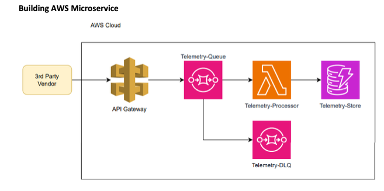

# Telemetry Processor Microservice

This project implements a serverless microservice on AWS for processing telemetry data. The architecture includes an API Gateway, SQS Queue, Lambda Function, DynamoDB Table, and Dead Letter Queue (DLQ).

## Architecture Overview



- **API Gateway**: Receives HTTP requests from a third-party vendor.
- **Telemetry-Queue (SQS Queue)**: Stores incoming telemetry data temporarily.
- **Telemetry-Processor (Lambda Function)**: Processes messages from the SQS queue and stores them in the DynamoDB table.
- **Telemetry-Store (DynamoDB Table)**: A DynamoDB table where telemetry data is stored.
- **Telemetry-DLQ (Dead Letter Queue)**: Captures messages that cannot be processed by the Lambda function.

## Prerequisites

- [AWS CLI](https://aws.amazon.com/cli/) configured with appropriate permissions.
- [AWS SAM CLI](https://aws.amazon.com/serverless/sam/) installed.
- Node.js installed on your machine.

## Installation 

`` git clone git@github.com:khemrajregmi/awsSAM_telemetry.git``

``cd awsSAM_telemetry ``

## Install Node.js dependencies
``npm run build``
## Compile Typescript to Javascript 
``npm run build``

## Validate the AWS SAM template:
``sam validate``


## Run Unit Tests:
``npm run test``

## Deploying to AWS
Follow these steps to deploy the application to AWS:

Build the application:
``sam build``
Deploy the application:
``sam deploy --guided``

 


## Project Structure

```plaintext
├── src
│   └── handlers
│       └── write-telemetries.ts     # Lambda function handler
├── build                            # Compiled JavaScript files
│   └── handlers
│       └── write-telemetries.js
├── tests                            # Unit tests for Lambda function
│   └── write-telemetries.test.ts
├── template.yaml                    # AWS SAM template defining the infrastructure
├── tsconfig.json                    # TypeScript configuration file
├── package.json                     # Node.js dependencies and scripts
├── package-lock.json                # Exact versions of installed dependencies
├── README.md                        # Project documentation
└── .gitignore                       # Files and directories to be ignored by Git 

